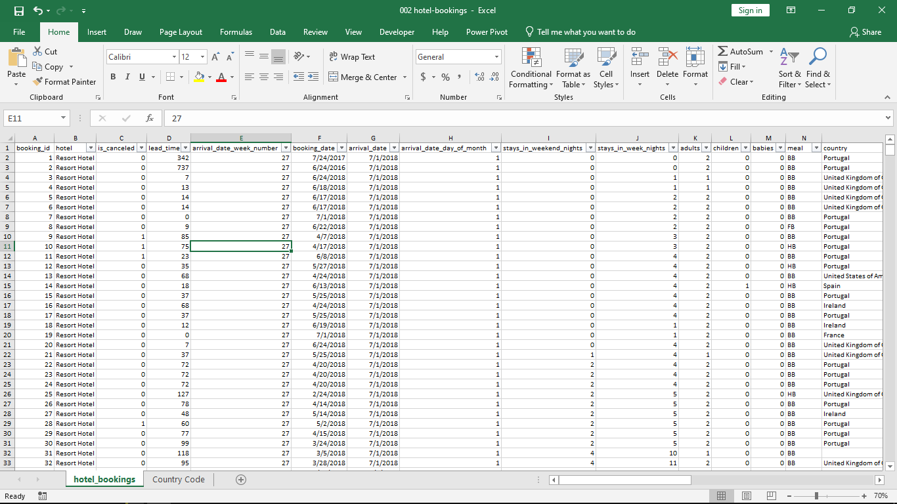
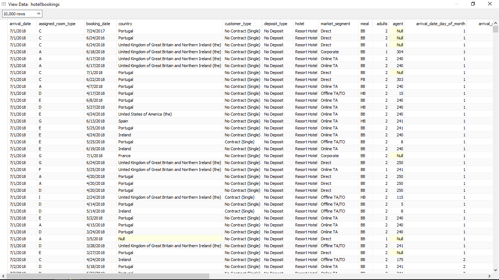
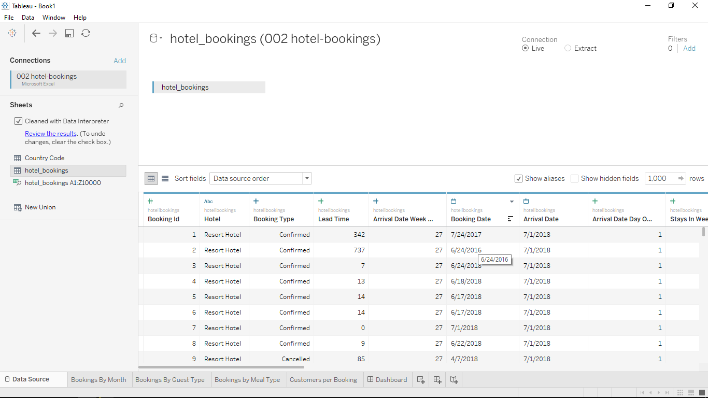
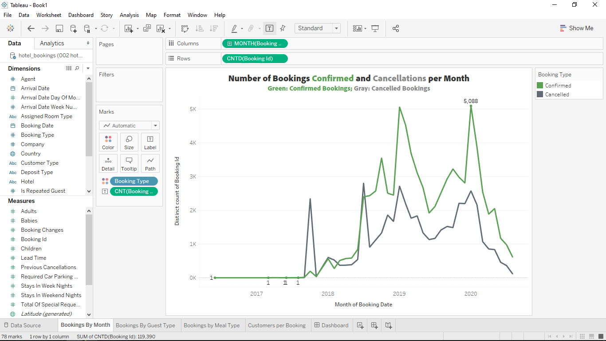
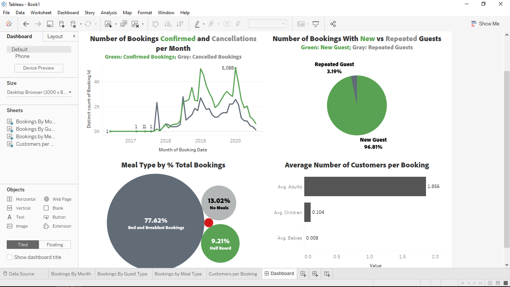
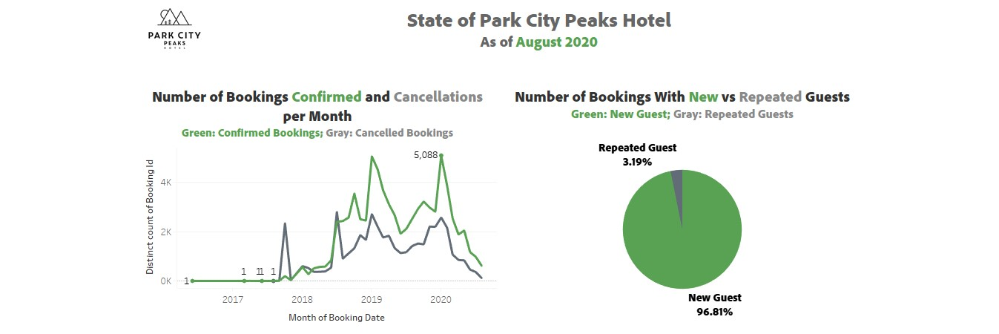
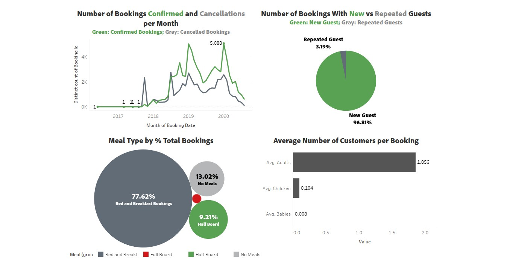

# Tableau Data Analysis Project (Park City Peak Hotel)

## Role
Tableau Developer

## Tools
Tableau, SQL, Excel & Python

## Project goal
A client approached me with a large amount of data from multiple sources, including spreadsheets, databases, and cloud-based applications. They needed a way to visualize and analyze this data in a way that was easy to understand and provided actionable insights. They also wanted to be able to update the dashboard regularly with new data.

## Goals & Expectations
The goal of the project was to:
- Determine the number of bookings and cancellations the hotel had monthly, 
- Determine how many guests became repeat customers, 
- Determine the food that was mostly purchased by guests at the hotel, 
- Determine if most guests travelled alone/as a couple/with kids.
 

## Solution
I worked closely with the client to create a Tableau dashboard that met their specific needs. The process began by cleaning and preparing the data, consolidating it into a single data model. and then creating custom visuals and interactive filters that allowed the client to explore the data in detail. 

 

To ensure that the dashboard could be updated regularly with new data, I set up automated data refreshes from the client's various data sources. I also provided the client with training on how to use Tableau to update and customize the dashboard on their own. 

 

The end result was a dynamic and interactive dashboard that provided the client with valuable insights into their data. The client was thrilled with the dashboard's ease of use and flexibility, and they were able to make data-driven decisions with confidence.

